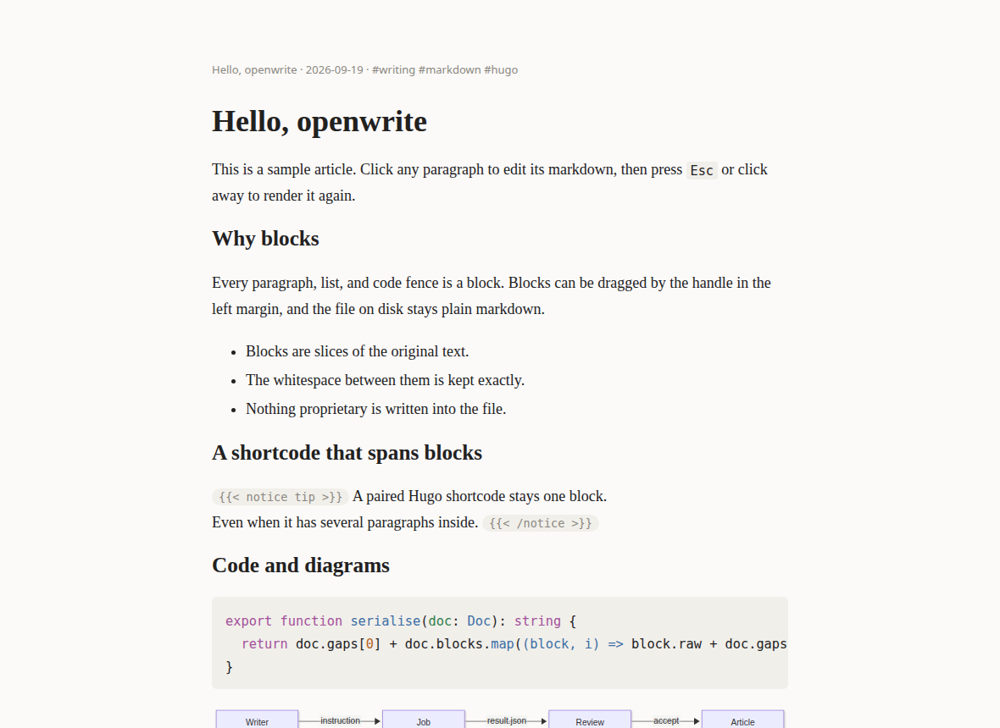
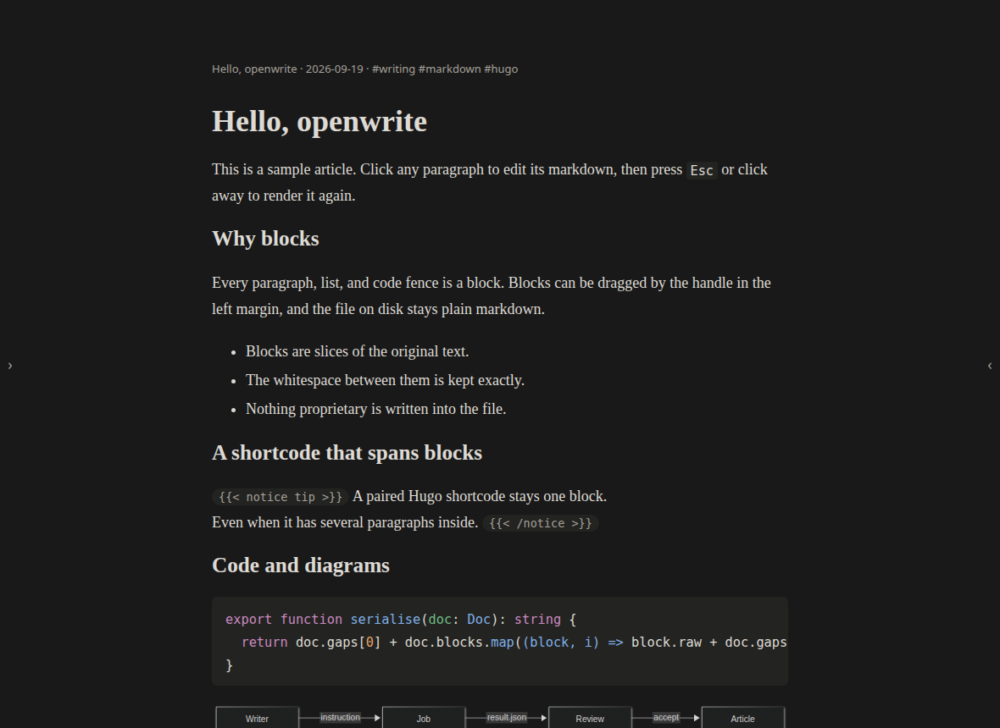
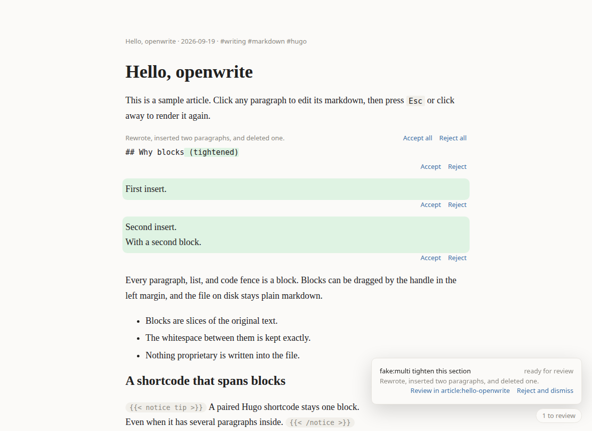
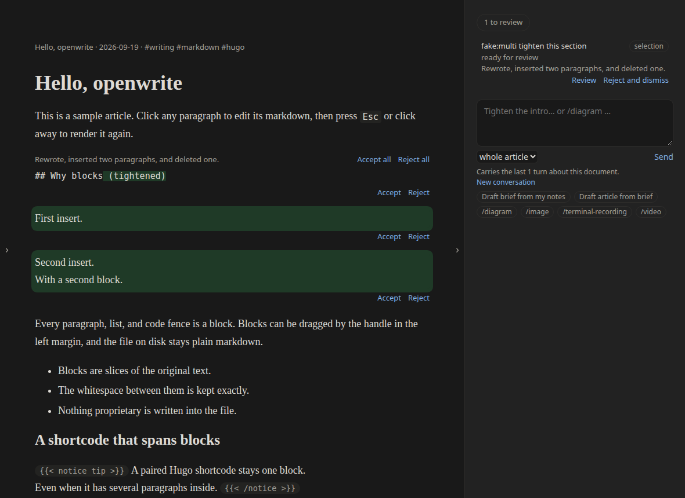

# openwrite

A local-first, block-based markdown editor for technical blog posts, with agent-powered
editing. The file on disk is plain markdown; agents propose, the writer approves.

| Light | Dark |
| --- | --- |
|  |  |
|  |  |

## Setup

Requires Node.js ≥ 24.

```bash
npm install
npm start          # builds the client if needed, opens the editor on a copy of the sample workspace
```

`npm start` copies `sample-workspace/` to `.openwrite/sample-workspace/` on first run and opens
that copy. To open your own workspace:

```bash
npm start -- --workspace /path/to/workspace     # or OPENWRITE_WORKSPACE=/path/to/workspace
```

The server binds `127.0.0.1` only. `npm run dev` is the exception: Vite listens on every
interface, so the editor is reachable from your network at `http://<this machine's IP>:5173`,
with no auth.

## Using the editor

- Click a block to edit its markdown; `Esc` or a click elsewhere renders it again.
- Arrow keys cross block edges. `Enter` on an empty last line starts a new block. `Backspace` at
  the start of a block merges it into the one above. Pasting several paragraphs re-splits on blur.
- Hover a block to get the drag handle in the left margin (keyboard: focus the handle, `Space`,
  arrows, `Space`).
- `Ctrl/Cmd+Z` and `Ctrl/Cmd+Shift+Z` undo and redo across the whole document, reorders included.
- Paste or drop an image: it is saved next to the article and referenced with a relative path.
  An SVG is sanitised first (scripts, event handlers, `foreignObject` and external references
  are removed, and a notice says what went); one that cannot be read safely is refused.
- Two edge panels, both closed at first: **Files and actions** on the left (`Ctrl/Cmd+B` or the
  handle at the left edge) and **Agent** on the right (`Ctrl/Cmd+Alt+B` or the right handle).
  The left one lists the workspace, every article (the open one marked), New article,
  `strategy.md`, the article's brief, export, theme and settings. Opening or closing a panel
  never takes the keyboard from the block you are typing in. Their open/closed state is kept in
  `.zen/config.json`, per workspace — with one exception on purpose: in a window too narrow for
  it to sit beside the text, a remembered left panel stays closed after a reload until you open
  it again, so it never comes back over the article.
- A panel docks beside the text only when the text keeps its full width. On a narrower window
  the agent panel follows the article, and the left panel slides over the page as a drawer that
  a pick, `Esc` or a click elsewhere closes.
- `Esc` inside a panel gives the keyboard back to where it was. Elsewhere it does what it always
  did: render the open block, close the pill, the palette or the settings.
- `Ctrl/Cmd+K` opens the command palette, grouped by Documents, Agent, Export, Workspace and App.
  It reaches every command, including the ones the panels show. Every command, control and setting
  has one home, listed in [docs/ui-inventory.md](docs/ui-inventory.md).
- Changes are saved automatically. If the file changes on disk, the editor reloads it and keeps
  the block you are typing in.

## Working with agents

- Select text in a block, or select whole blocks (click the left margin, shift-click or drag to
  extend), and a small prompt pill appears. Start typing (or press `Ctrl/Cmd+I` from inside an
  editor), press `Enter`, and carry on writing. `/skill-name` at the start runs a skill.
- The **Agent** panel on the right is the conversation. It has:
  - a message box for the whole article or a research question (`Enter` sends, `Shift+Enter`
    starts a new line, `/name` runs a skill);
  - every job as a turn, oldest first, with its scope, progress, result and actions.

  Each message is an ordinary job, reviewed like one from the pill. A follow-up ("make it
  shorter") carries the earlier turns about the same document to the agent. The panel says how
  many, and **New conversation** starts clean.
- A job's scope is `selection` (the target blocks), `whole article`, or `research` (no edits; the
  answer opens at the top of the agent panel, where any note can be inserted as a block).
- Results arrive as ghost diffs in place: replacements as inline diffs, insertions as ghost
  blocks, deletions struck through. Accept or reject per change or for the whole job — by mouse,
  or focus a change and press `Enter` / `Backspace` (`Ctrl/Cmd+Enter` / `Ctrl/Cmd+Backspace` for
  the whole job). Nothing enters the article until you accept it.
- Many jobs run at once. A second job on a busy block waits until the first is accepted or
  rejected, then runs against the outcome. A whole-article job runs alone. Editing is never
  blocked; if you edit a block while its job runs, the result is compared with your current
  text and marked "changed since request".
- If a save fails, a notice stays in view and the save is retried by itself; leaving the tab
  saves at once.
- While the agent panel is not beside the text (closed, or below the article on a narrow
  window), a job count in the bottom-right corner shows running, review and failed work.
  Clicking it opens the panel, or scrolls to it. There each job shows its status, streamed
  progress, cancel, and the raw output of failed or stale jobs.

## Workspace layout

```
<workspace>/
  strategy.md                 global voice, audience, structure rules
  sources/                    reference files agents may read
  content/posts/<slug>/       Hugo leaf bundle: index.md + assets
  .zen/
    config.json               settings (validated; every key has a default)
    articles/<slug>/brief.md  per-article outline, angle, target reader
    jobs/<job-id>/            one directory per agent job (see "Job retention")
    skills/<name>.md          optional: this workspace's own skills (see "Adding a skill")
```

`contentDir` in `.zen/config.json` is relative to the workspace by default. It may be an absolute
path to point straight into a Hugo site's `content/` directory; articles then live where Hugo
wants them and `hugo server` is the true preview.

## Managing workspaces

You can work on more than one workspace without restarting the server. The editor opens
another one, creates one, and remembers the ones you have opened.

Switching, opening and creating are in the left panel's Workspace section and in the command
palette (`Cmd/Ctrl+K`). Renaming, removing and deleting are in the palette only:

| Command | What it does |
| --- | --- |
| `Switch to workspace: <name>` | opens one you have opened before |
| `Open workspace…` | opens one in the workspaces folder, by its name |
| `New workspace…` | scaffolds a new one in the workspaces folder under a name you give, and opens it |
| `Rename workspace: <name>` | changes the label you see, nothing on disk |
| `Remove workspace from the list: <name>` | forgets it; every file stays where it is |
| `Delete workspace from disk: <name>` | deletes it, after you type its name (see below) |

The list of remembered workspaces is the one piece of state that cannot live in a workspace,
so it lives beside them:

```
$XDG_CONFIG_HOME/openwrite/workspaces.json     (default: ~/.config/openwrite/workspaces.json)
```

It holds a label and a path per workspace, nothing else. If it is missing, unreadable or
hand-edited into something invalid, the editor starts with no remembered workspaces rather
than refusing to start. Nothing in it is secret, and you can edit or delete it by hand.

**Creating** a workspace scaffolds `strategy.md`, `.zen/config.json`, `content/posts/` and
`sources/` in a new folder of the **workspaces folder**, `.openwrite/workspaces/` in this repo
(gitignored). You give a name — lowercase letters, digits and hyphens, such as `my-blog` — never
a path: the editor cannot be asked to create or open a workspace anywhere else on disk, so `/`,
`..` and absolute paths are refused, and so is a symlink sitting at that name. A name that
already has something in it is refused too. To work on a directory elsewhere, such as a Hugo
site, start the server on it with `--workspace`; it is remembered, and you can switch back to it
from the list.

**Removing a workspace from the list** deletes nothing on disk. **Renaming** changes the label
you see, nothing else.

**Switching** first saves whatever is unsaved. Agent jobs of the workspace you are leaving are
cancelled and marked stale — their files stay where they are, and switching back finds them
again — so no job of one workspace can ever write into another.

### Deleting a workspace from disk

This one is irreversible. There is no undo and no trash: the directory is gone. To make it
hard to do by accident, the editor asks you to type the workspace's name exactly, and the
server refuses the request unless it comes back matching. It also refuses:

- a workspace that is **not in the remembered list** — the path you delete is always one the
  editor already knows, never one supplied in the request;
- the workspace that is **currently open** — switch somewhere else first;
- the **`sample-workspace/` that ships with this project**, which every test copies from;
- a workspace whose **`contentDir` points outside it** — a workspace pointed at a real Hugo
  site cannot be deleted from the editor at all, because deleting it would either miss those
  posts or reach outside the workspace to take them. Remove it from the list instead.

Nothing outside the workspace's own directory is ever deleted: a symlink inside it that
points somewhere else is unlinked, not followed, and a remembered root that is itself a
symlink is refused.

## Agents and settings

Settings are reachable from the palette (`Settings…`) and stored in `<workspace>/.zen/config.json`
(validated; an invalid file is reported and never overwritten):

| Key | Meaning |
| --- | --- |
| `mainAgent` | `claude`, `codex`, `fake`, or `herdr` (optional, needs `herdr` on `PATH`; see "herdr" below). Switching is a settings change, nothing else. |
| `taskAgents` | per-task overrides, for example `{ "image": "codex" }`; resolved before `mainAgent` |
| `contentDir` | `content` by default; relative to the workspace, or an absolute path into a Hugo site |
| `theme` | `system`, `light`, `dark` |
| `concurrency` | how many agent processes run at once (jobs waiting for review do not count) |
| `jobTimeoutSec` | a job that produces no result in this time is stopped |
| `jobRetentionDays` | `30` by default: when the workspace opens, done, failed and cancelled jobs (and dismissed ones) not updated for this many days are deleted from `.zen/jobs/`. `0` keeps them until cleared. See "Job retention" below |
| `adapters.<name>` | `command`, `model`, `extraArgs`, and `baseArgs` (replaces the verified default command line; `{jobDir}`, `{jobRel}`, `{workspace}` are substituted) |
| `ui.leftPanel`, `ui.rightPanel` | whether the two edge panels are open; `false` by default. Set by the edge handles and `Ctrl/Cmd+B` / `Ctrl/Cmd+Alt+B`, not by the Settings form. Kept per workspace; in a narrow window a remembered left panel stays closed after a reload until opened by hand |

The agent CLIs use your own logins; openwrite stores no keys. Agents run with the narrowest
permissions that work: `claude` may read the workspace and write only inside its job directory;
`codex` may write only inside its job directory (its sandbox cannot restrict reads). The exact
command lines and how they were verified are in [DECISIONS.md](DECISIONS.md), "Real agents".
`npm start -- --adapter fake` forces the built-in fake agent for a session.

Every job gets copies of `strategy.md` and the article's `brief.md` and is told to follow them.
The palette has `Edit strategy`, `Edit brief`, `Draft brief from my notes`, and
`Draft article from brief`; the two drafts are ordinary jobs whose proposal you review.

To check a real adapter on your machine (spends credits, never part of the test suite):

```bash
node scripts/verify-adapter.ts claude --extra="--max-budget-usd 0.50"
node scripts/verify-adapter.ts codex
```

### herdr (optional)

[herdr](https://herdr.dev) is a terminal multiplexer for coding agents. With `mainAgent: "herdr"`
a job runs as an interactive `claude` in a pane of the named herdr session `openwrite-jobs`
(`adapters.herdr.session` changes the name), confined exactly like the direct adapter. You can
attach while it runs — the agent panel shows `herdr session attach openwrite-jobs` — watch sub-agents,
and step in when the agent blocks; the job still completes through the file contract. It needs
`herdr` on `PATH`, has no spend cap, and supports claude only. What was tried and why it was
adopted: [docs/herdr-evaluation.md](docs/herdr-evaluation.md).

## Adding an adapter

An adapter only launches a process and relays progress; the file contract does the rest.

1. Implement `AgentAdapter` from `src/server/adapters/types.ts`:
   `start(jobDir, options) → { progress: AsyncIterable<{ text }>, done: Promise<Completion>, cancel() }`.
   For a CLI, describe it as a `CliSpec` (`buildArgs`, `readLine`, `authPattern`, `loginHint`, and an
   optional `buildPrompt` when the agent's working directory is not the workspace) and
   wrap it with `createProcessAdapter` from `process-adapter.ts` — see `claude.ts` and `codex.ts`.
   Launching, line splitting, bounded output, process-tree cancel, and failure mapping come with it.
2. Register it in `createApp` (`src/server/app.ts`): `registry.register(createMyAdapter())`. It
   then appears in settings; `adapters.<name>` overrides work without further code.
3. Verify every flag against the tool's `--help`, prove the write confinement with
   `scripts/verify-adapter.ts`, and record both in `DECISIONS.md`. Never default to a permission
   bypass.
4. Test the command line and the stream mapping like `src/server/adapters/adapters.test.ts`.
   No test may need the real CLI.

## Skills and media

Media types are agent skills, not editor features: the editor only knows that a job can return
assets plus blocks that reference them. A skill is a prompt template in `skills/` (or in a
workspace's own `.zen/skills/`, see [Workspace skills](#workspace-skills)) that any adapter can run. Run one from the palette (`Run skill: <name>`), from its `/name` chip in the agent panel, or
start an instruction with `/name`.

| Skill | What it does |
| --- | --- |
| `diagram` | returns a fenced `mermaid` block (the editor renders mermaid fences anyway) |
| `terminal-recording` | writes a script, records it with `asciinema`, converts it to a gif with `agg`, returns the cast and the gif. Needs both tools on `PATH`; when one is missing the job fails at once with "Missing on PATH: …" and no agent is started. openwrite never installs them. |
| `image` | runs on the agent configured for image tasks in settings (`taskAgents.image`), otherwise on the main agent |
| `video` | **a stub.** It is listed and refuses to run. A real one would be a prompt like `image`, an agent or tool that can produce video, and an `.mp4`/`.webm` asset referenced from a Hugo `video` shortcode or a `<video>` tag. |
| `draft-brief`, `draft-article` | behind "Draft brief from my notes" and "Draft article from brief", in the palette and as starters in the empty agent panel |

## Adding a skill

Add `skills/<name>.md`. Nothing else changes: the server lists the directory, the palette gets a
"Run skill" entry, and `/name` works in the prompt pill.

```markdown
---
name: haiku                      # must match the file name
description: Rewrite as a haiku  # shown in the palette
scope: blocks                    # blocks | article | research (default: blocks)
task: text                       # optional; picks taskAgents.<task> from settings
requires: [sometool]             # optional; checked on PATH before an agent starts
allow: [Bash(sometool *)]        # optional; extra tool allowances (claude adds them to its allow list)
network: false                   # optional; codex opens the network only when true
stub: false                      # optional; true lists the skill but refuses to run it
document: current                # optional; current | brief | article — which document a palette-started job edits
---
The prompt: what to produce, as ops on the target blocks, and which files to put into `assets/`.
```

The body is inserted into the job's `instruction.md` under "Skill: <name>", between the writer's
instruction and the contract rules, so it should describe the *what* and leave the `result.json`
format to the contract.

### Workspace skills

A skill that belongs to one blog rather than to openwrite goes in that workspace:
`<workspace>/.zen/skills/<name>.md`, same header, same body. It is listed after the shipped ones
(its palette hint says "workspace skill"), runs through `/name`, the `/name` chips and
`Run skill: <name>` like any other, and its `requires:` goes through the same `PATH` preflight.
The list follows the open workspace: switching workspaces shows the other one's skills, and
saving, breaking or deleting a file updates the palette while the editor is open.

The rules, all enforced by the server (`src/server/skills.ts`):

- **A shipped name wins.** A workspace file called `diagram.md` is not loaded; the shipped
  `diagram` still runs, and the file is reported. Rename it to use it (`my-diagram.md`).
- **It cannot widen the agent.** `allow:` and `network: true` are honoured only in the shipped
  `skills/` folder, which is reviewed like code; a workspace skill that sets them is reported
  instead of loaded.
- **It stays in the workspace.** A link whose target is outside the workspace, a hard link, a
  folder, a FIFO or anything that is not a regular file, a file over 64 KiB, a file that is not
  UTF-8, and a file name that is not kebab case are refused. At most 100 files are read.
- **`name:` must match the file name**, as in `skills/`.

A file that is refused does not stop the others. The editor says why, once, as a notice, and
keeps the reason in the agent panel ("Skills not loaded", under the `/name` chips) and in the
palette (`Skill not loaded: .zen/skills/<file>`) until the file is fixed.

## Export

From the left panel's Actions or the palette, for the article on screen; each produces a zip
download:

- **Export: markdown + assets** — the leaf bundle as is: exact markdown bytes and every file next
  to it.
- **Export: standalone HTML + assets** — `index.html`, one `style.css`, and the assets. The
  article is rendered with the editor's own pipeline; mermaid diagrams become inline SVG, so the
  page needs no script and opens offline. Hugo `figure` shortcodes become `<figure>`; other
  shortcode tags are dropped and their inner content kept. A diagram that cannot render fails
  the export with a message.

No DOCX or PDF.

## The job file contract

The contract between the editor and an agent is files, so it works with any agent. For each job
the server creates `<workspace>/.zen/jobs/<id>/`:

| File | Written by | Content |
| --- | --- | --- |
| `instruction.md` | server | the writer's prompt, the scope and its rules, the skill body if any, the output schema |
| `article.md` | server | a snapshot of the document, each block wrapped in `<!-- zen:block id=bN -->` … `<!-- /zen:block -->`; targets carry `target`. An ID is `bN`, or `liveN` for text the writer had not committed yet (an op on one comes back stale). Markers exist only here, never in the article. An empty document has the virtual block `b0`. |
| `targets.json` | server | `{ "scope", "blockIds", "selection" }` — `selection` has the selected text and, for a selection made in edit mode, `from`/`to` offsets into the block |
| `strategy.md`, `brief.md` | server | copies of the workspace strategy and the article's brief |
| `conversation.md` | server | only on a follow-up turn: the earlier turns about the same document, oldest first, with what came of each. At most 6 turns: 600, 300 and 1500 characters for instruction, summary and research notes, 8000 for the file. Named in `instruction.md`'s Context list; absent on a first turn. |
| `job.json`, `progress.log` | server | lifecycle state (`version: 1`), the settings the job was launched with, bounded progress log |
| `result.json` | agent | the proposal (below) |
| `assets/` | agent | generated files, referenced from markdown as `assets/<file>` |
| `result.invalid.json`, `repair.md` | server | only after a rejected result: the rejected output and the repair instructions |

The agent may read the workspace (so it can use `sources/`) and runs with the workspace as its
working directory — except `codex`, which runs with the job directory as its working root (that
is what confines its writes) and is told in its prompt where the workspace is and how the paths
map (DECISIONS.md, "Real agents"). It writes `result.json` and `assets/`, and modifies nothing
else.

```json
{
  "summary": "one line describing what was done",
  "ops": [
    { "op": "replace", "block_id": "b12", "markdown": "..." },
    { "op": "insert_after", "block_id": "b12", "markdown": "..." },
    { "op": "insert_before", "block_id": "b12", "markdown": "..." },
    { "op": "delete", "block_id": "b13" }
  ],
  "assets": [{ "file": "assets/diagram.png", "alt": "..." }],
  "notes": "free-form markdown, used for research answers and caveats"
}
```

The file is validated with zod (unknown ops or keys reject it) and then against the job: for
`blocks` scope, ops may only touch the target blocks or insert next to them; `research` must have
no ops; asset paths must stay inside `assets/` and exist; an `.svg` asset must be one the SVG
sanitiser can read (it is served and copied into the bundle sanitised,
`DECISIONS.md`). A rejected result gets one automatic
repair attempt; after that the job fails and the raw output is shown in the agent panel.

Job states: `queued → running → validating → (repairing →) ready → settled`, or `failed`
(`missing-cli`, `missing-tool`, `auth`, `timeout`, `invalid-result`, `exit`), `cancelled`,
`stale`. A stale job (deleted target, app restart, page reload) keeps its output visible.

### Job retention

A job directory stays on disk after the job ends, so nothing an agent produced is lost by
accident. Two things remove it, and both only ever touch *finished* jobs — `settled`, `failed`,
`cancelled`, `stale` — never one that is queued, running, or `ready` (awaiting review):

- **Clear finished jobs** (palette, `POST /api/jobs/clear-finished`) deletes every finished job
  of the open workspace, listed or dismissed, from this session or an earlier one, and says how
  many it cleared and kept. A finished job whose agent process has not exited yet is kept until
  it has. The request names the workspace the tab shows; after a switch it is refused (409).
- **Pruning when a workspace opens** (server start and every switch) deletes done, failed and
  cancelled jobs, and dismissed finished ones, not updated for `jobRetentionDays` days (30 by
  default; `0` turns it off). A stale job that was not dismissed is on screen with its output,
  so only the writer clears it.

Deletion considers only names that are job ids directly under `.zen/jobs/`, refuses a symlink
there, and walks each directory with `lstat`: the agent's links are unlinked, never followed.
A directory whose `job.json` is missing or invalid is left alone and reported.

## Development

```bash
npm run dev          # Node server (watch) + Vite on every interface, http://127.0.0.1:5173
npm run format       # biome format --write
npm run lint
npm run typecheck
npm test             # Vitest; one file: npm test -- src/server/paths.test.ts
npm run test:e2e     # Playwright; first run: npx playwright install --with-deps chromium
npm run build
node scripts/screenshots.ts   # regenerates docs/screenshots/ (light and dark)
```

Every check uses the sample workspace, temp directories, and the `fake` adapter. No test needs
network, keys, or an agent CLI.
