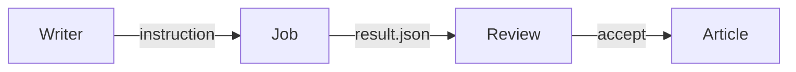

# Hello, openwrite

This is a sample article. Click any paragraph to edit its markdown, then press `Esc` or click away to render it again.

## Why blocks

Every paragraph, list, and code fence is a block. Blocks can be dragged by the handle in the left margin, and the file on disk stays plain markdown.

- Blocks are slices of the original text.
- The whitespace between them is kept exactly.
- Nothing proprietary is written into the file.

## A shortcode that spans blocks


A paired Hugo shortcode stays one block.

Even when it has several paragraphs inside.


## Code and diagrams

```ts
export function serialise(doc: Doc): string {
  return doc.gaps[0] + doc.blocks.map((block, i) => block.raw + doc.gaps[i + 1]).join('')
}
```



## A table

| Scope    | What it does                         |
| -------- | ------------------------------------ |
| blocks   | Edits the blocks you selected        |
| article  | Restructures the whole piece         |
| research | Answers a question in the notes pane |


## What is next

Select some text, type an instruction, and keep writing while the agent works.

Results arrive as ghost diffs in place. Accept what you like and reject the rest.

[hugo]: https://gohugo.io
